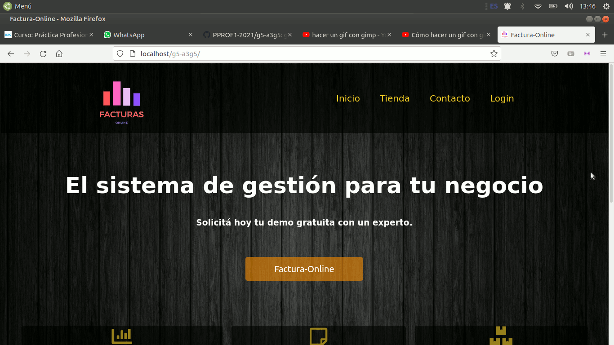

<h1 align="center">Gestion Deposito (ISPCA3G5)</h1>

<i>Una lista seleccionada de increíbles READMES de perfiles de Github</i>

---

# ISPCA3G5
## Gestión de depósito (Sistema de Facturación)
### https://pprof1-2021.github.io/g5-a3g5/
 
 
 
 

####
---
**Perspectiva del producto:**
  
El sistema será un producto diseñado para trabajar en entornos WEB, lo que facilita la manera de trabajar, manejando la facturación y el inventario del mismo, manejo de proveedores. también como punto importante tendrá un control de stock y estará vinculado con la tienda virtual realizando los cambios correspondientes.

 
 

---

###         Aula 3 -  Grupo 5
---
 
 

#### 1     Introducción
---

El documento es una Especificación de Requisitos Software (ERS) para el Sistema de información para la gestión de procesos y control de inventarios. Esta especificación se ha estructurado basándose en las directrices dadas por el estándar IEEE Práctica Recomendada para Especificaciones de Requisitos Software ANSI/IEEE 830, 1998.
 

#### 1.1         Propósito
---

Este sistema fue creado con el objetivo de brindar una solución tecnológica para el área de gestión administrativa de tu empresa o emprendimiento de manera virtual utilizando tu tienda virtual, en donde el uso de software o tablas de Excel que no son funcionales a la hora de facturar.
Bajo esta problemática se creó un sistema online, para poder ingresar desde cualquier lugar, adaptable a la tienda virtual, al sistematizar los datos se logrará un trabajo más eficiente.

 

#### 1.2         Alcance
--- 

El sistema de facturación está apuntado a toda persona que tiene comercio online, como woocommerce o tienda online en Facebook e Instagram, sincronizando la base de datos con el sistema de G.D, manteniendo así todo el historial de ventas, presupuestos, nota de crédito o la cartera de clientes.

--- 
 

#### 2.1         Perspectiva del producto
--- 

El sistema será un producto diseñado para trabajar en entornos WEB, lo que facilita la manera de trabajar, manejando la facturación y el inventario del mismo, manejo de proveedores. también como punto importante tendrá un control de stock y estará vinculado con la tienda virtual realizando los cambios correspondientes.

--- 
 

#### 2.2         Funcionalidad del producto (GESTIÓN DE PROCESOS)
--- 

  

 

--- 
## Contribuyendo

Damos la bienvenida a todos los colaboradores 💙

- **Clavaguera Abril**. Estudiante de Desarrollo Web y Aplicaciones Móviles [Ver Github](https://github.com/Abrilc90).
- **Mónica Antich**. Estudiante de Desarrollo Web y Aplicaciones Móviles [Ver Github](https://github.com/MonicaAntich).

- **Zapata, Mónica**. Estudiante de Desarrollo Web y Aplicaciones Móviles [Ver Github](https://github.com/MonicaVZapata).

- **Gonzalez Mario**. IEstudiante de Desarrollo Web y Aplicaciones Móviles [Ver Github](https://github.com/mariogonzalezispc).

- **Ferreyra Gastón**. Estudiante de Desarrollo Web y Aplicaciones Móviles [Ver Github](https://github.com/gastonloco).
--- 

## Sprint 1

Semana del 12/10:

- Especificación de Requerimientos IEEE- 830 (Foro y GitHub)
- Front: Estructura HTML
- Git : Instalación y registración
- Kanban
- Mapa del Sitio

  

--- 

## Sprint 2

Semana del 01/11:
#### Frontend

- HTML : Navegabilidad - Links correctos 
- BOOSTRAP
- CSS 
- Responsive
#### Backend

- Script de la BD en MySQL
- Consultas : Insert - Select

  

--- 

## Sprint 3

Semana del 16/11:

- Producto funcionando con Login 
El Entregable de este sprint será el resultado de las iteraciones anteriores, con un producto incremental en lo que respecta a funcionalidades. 

#### Frontend
- HTML -(25 de octubre 2021)
- BOOSTRAP-(25 de octubre 2021)
- CSS -(25 de octubre 2021)
- Responsive-(25 de octubre 2021)
- JS-(22 de noviembre 2021)
- PHP-(22 de noviembre 2021)

#### Backend
- MySQL-(1 de Noviembre 2021)
- Consultas--(1 de Noviembre 2021)
--- 
 </img>
--- 

### 🎥 Listado de videos

<!-- YT:START -->
- [Practica Profesionalizante 1_Parte1][video1]
- [Practica Profesionalizante 1_Parte2][video2]
- [IEFI_Programacion_1_Parte1][video3]
- [IEFI_Programacion_1_Parte2][video4]
- [IEFI_Base de Datos][video5]

<!-- YT:END -->

---
[video1]: https://www.youtube.com/watch?v=oyQQRNPyZ0E
[video2]: https://www.youtube.com/watch?v=kpJN7WFziL4
[video3]: https://www.youtube.com/watch?v=ffQc45vwrT0&t=3s
[video4]: https://www.youtube.com/watch?v=OdESUNqbz74
[video5]: https://www.youtube.com/watch?v=YJ_Bg6fGyso&t=169s

